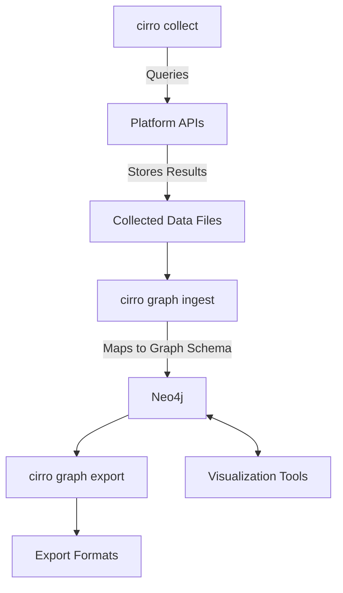

# Architecture Overview

Cirro uses a two-stage architecture:

1. **Data Collection (`cirro collect`)**: Gathers data from supported platforms and stores it in platform-specific output files
2. **Graph Operations (`cirro graph`)**: Ingests collected data into a graph database and exports query results

## Components

### Collection (`cirro collect`)

The collection workflow is responsible for:

- Authenticating to the target platform using method-specific providers
- Querying platform APIs and normalizing raw responses
- Writing collected data to files for later graph ingestion
- Supporting optional platform modules through feature flags

### Graph Operations (`cirro graph`)

The graph workflow handles:

- Reading collected data from supported source formats
- Mapping entities and relationships into graph schema nodes and edges
- Loading graph data into Neo4j
- Creating indexes and constraints where required
- Exporting graph data into multiple output formats

## Schema Extensibility

Cirro is built to support different platform schemas without changing the core workflow:

- **Platform support is implemented in code**: collectors and ingestors for each source are added as Rust modules
- **YAML graph specs drive mappings**: node, edge, and property mappings are defined in YAML files consumed by ingestion
- **Ingest pipeline applies mappings consistently** across supported platforms
- **Feature flags control included modules** so builds can include only required platform functionality

## Data Flow

1. **Authentication**: A platform-specific auth method is selected
2. **Data Collection**: APIs are queried to gather environment and identity relationships
3. **Local Output**: Data is written to collector output files
4. **Schema Mapping**: The ingest workflow maps source data into graph schema definitions
5. **Graph Loading**: Data is loaded into Neo4j with relationships preserved
6. **Analysis & Export**: Use graph tools and export commands for downstream analysis
