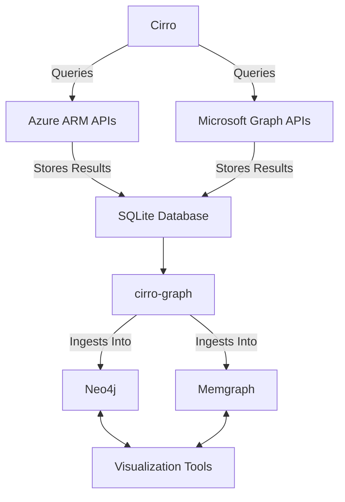

# Architecture Overview

```mermaid
graph TB
    A[Cirro] -->|Queries| B[Azure ARM APIs]
    A -->|Queries| C[Microsoft Graph APIs]
    B -->|Stores Results| D[SQLite Database]
    C -->|Stores Results| D[SQLite Database]
    D -->  H[cirro-graph]

    H -->|Ingests Into| E[Neo4j]
    H -->|Ingests Into| F[Memgraph]
    

    E <--> G[Visualization Tools]
    F <--> G

```

Cirro uses a two-stage architecture:

1. **Data Collection (`cirro`)**: Gathers data from Azure and stores it in a local SQLite database
2. **Data Ingestion (`cirro-graph`)**: Loads the collected data into your chosen graph database

## Components

### Cirro

The main `cirro` tool is responsible for:

- Authenticating with Azure using various methods
- Querying Azure Resource Manager (ARM) APIs
- Querying Microsoft Graph APIs
- Storing collected data in a local SQLite database
- Supporting multiple Azure cloud environments

### cirro-graph

The `cirro-graph` tool handles:

- Reading data from the SQLite database
- Transforming data for graph database compatibility
- Loading data into Neo4j or Memgraph
- Creating appropriate indexes and constraints
- Maintaining data relationships and properties

## Data Flow

1. **Authentication**: Cirro authenticates with Azure using your chosen method
2. **Data Collection**: APIs are queried to gather comprehensive environment data
3. **Local Storage**: Data is stored in an SQLite database for processing
4. **Data Transformation**: The ingest tool transforms data for graph database format
5. **Graph Loading**: Data is loaded into your chosen graph database
6. **Visualization**: Use graph database tools to query and visualize the data
